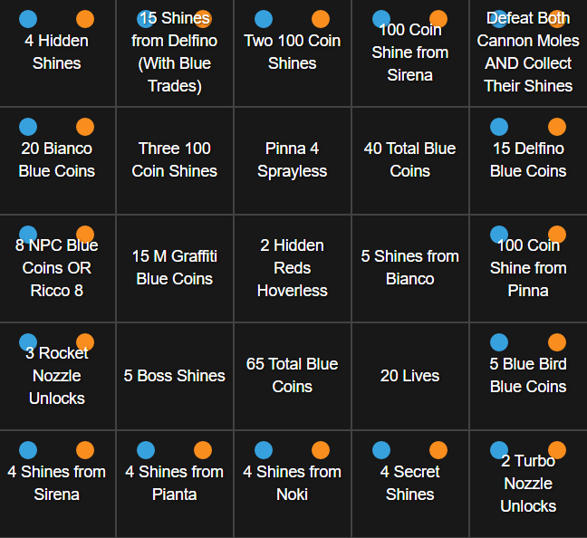
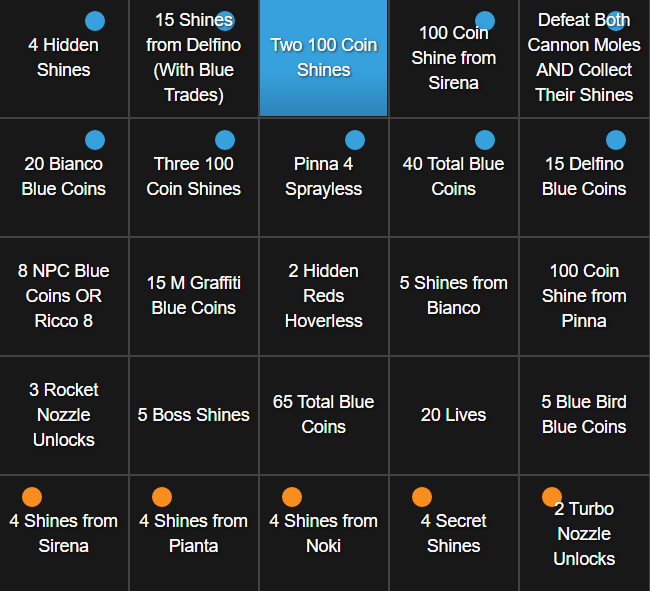
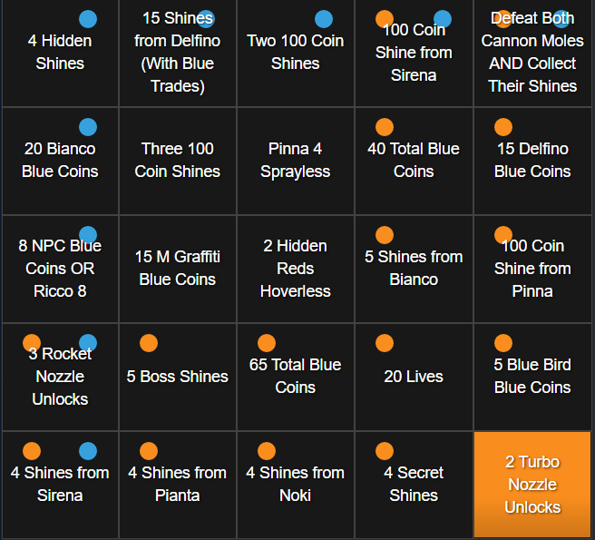
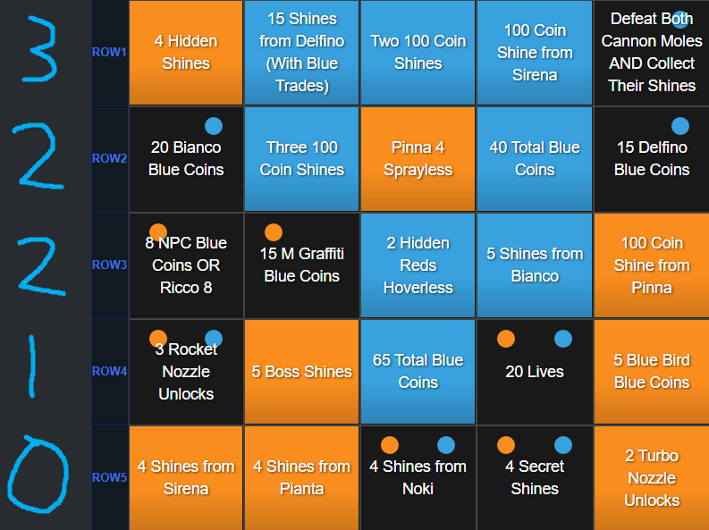

# Formats

Super Mario Sunshine 1v1 Lockout Bingo is played on a variety of formats. The following is a description of each format currently played or formerly played as part of official League play.

## Table of Contents

## General Rules

For all formats (unless stated otherwise), Super Mario Sunshine Bingo is played using a five by five grid of randomly selected goals of various types. Each player starts from a **new file**, revealing the card at the same time, and works to complete 13 goals before their opponent.

Once a goal is clicked by one player, it cannot be clicked by their opponent. This is the "lockout" in "lockout bingo".

GBS, or Gelato Beach Skip, is **banned** from use during matches, as it complicates the balance of Bingo. All other techniques are allowed, including all forms of EYG, Sirena Whenever, Damage Boosting, Pipe Clipping, etc. unless otherwise stated by a goal to be not allowed (Such as Pianta 3 Damageless, or Lily pad NO Pipe Clipping)

If you game over or crash during a match, you may resume play from an earlier save, but you must unclick any goals that you no longer have achieved on your file. For instance, if you restart play on airstrip, you must unclick all of your goals.

You are free to delay clicking a goal for any reason at any time, unless a format rule says otherwise. However, you are not considered to have achieved that goal until you click it. This means that if you delay clicking a goal for long enough, your opponent may click it before you do, which means you will not receive credit for achieving the goal.

## Regular Lockout / Vanilla Lockout

The simplest of the main variants played, there are no additional special rules. All the general rules apply, and the goal is to reach 13 goals before your opponent.

## Draft Lockout

Starting with the general rules, the goal is to reach 13 goals before your opponent. However, before play begins, there is a draft period, and for the first 30 minutes of play, drafted goals are protected from your opponent.

### The Draft Period

Before the match begins, there is a coin flip to determine who goes first in the draft. The board is then revealed, and each player, in snake order, selects 1-2 goals as their drafted goals, until both players have selected 5 goals. Goals are clicked off in a color distinct from both players normal colors, to indicate possession of them as drafted goals.

In the following example, Player 1 is going first.

Player 1 (One goal) -> Player 2 (Two goals) -> Player 1 (Two goals) -> Player 2 (Two goals) -> Player 1 (Two goals) -> Player 2 (One goal)

After the draft, play begins, and the protection period starts.

### The Protection Period

During the first 30 minutes of the match, the goals that were drafted can only be clicked by the player who drafted them. After the 30 minutes have passed, the goals can be clicked by either player. In scrim or non tournament play, it is a common courtesy to unclick your opponents goals at the 30 minute mark. During tournament play, commentators or restreamers may unclick the goals for you.

You **cannot** delay drafted goals that you drafted yourself, even after the first 30 minutes have passed. Once achieved, you must unclick them from your drafted color and click them in your primary color. Your may delay clicking your opponent's drafted goals.

Any goals that were undrafted can be clicked by either player at any time, and they may be delayed as normal.

## Row Control

Starting with the general rules, the goal is to win three out of the five rows on the bingo card, by achieving the majority (three out of the five) goals in that row. Players can win with a minimum of 9 goals.

## Invasion

Starting with the general rules, the goal is to reach 13 goals before your opponent. However, in Invasion, there are restrictions on what goals can be clicked at what time.

Most players utilize a tool called Bingosync+ when playing invasion to understand what goals are clickable and when. You can learn more about Bingosync+ [here](https://github.com/cyrillebenoit/bingosyncplus).

### Goal Clicking Rules

Players start with the outside 16 goals available to be clicked. Goals that are not on the outside of the card cannot be clicked until other goals are clicked. Here is an example card that illustrates this.

Once a goal is clicked on the outside of the card, players are then "locked" into their starting rows or columns.
For instance, in the below example, with Two 100 Coin Shines clicked, the blue player now starts from Row 1 of the card, and the orange player starts from Row Five.

If the first click is in a corner, then both the column and the row the corner goal is in are available as starting positions, and these options will exist until a second goal is clicked that decides whether play will continue in rows and columns.

Once sides are decided, play continues, with players clicking goals that are available to them, based on prior clicks. Players may click any number of goals in their "base", or where they start from. In the above, the blue player's base is Row 1, and they can click any number of goals in that row. They can also click as many goals in Row 2 that they have already clicked in Row 1, as many goals in Row 3 as they have clicked in Row 2, and so on. When using Bingosync+, the dots indicate if a goal can be clicked based on the current state of the board. Notice how the blue player cannot click a goal in Row 3, as they have clicked two goals in Row 2, and two goals in Row 3. They would need a third click in Row 2 before being able to click another goal in Row 3.

Once clicked, goals cannot be unclicked (unless they become unachieved, such as lives goals) in order to click a more advantageous goal in a particular row or column. Otherwise, despite these restrictions, all other normal rules apply, and the first to 13 goals wins.

## Lesser Played Formats

### Connect 5

Starting with the general rules, the goal is to reach 13 goals before your opponent, **or** by connecting a string of 5 goals in either a row, column, or diagonal. You **cannot** delay a goal that is part of your connect 5 for any reason. If you do so, it is no longer eligible to be a part of a connect 5 win, but still counts towards your 13 goals for victory.

Connect 5 was played in Season 2 of the Bingo League.
